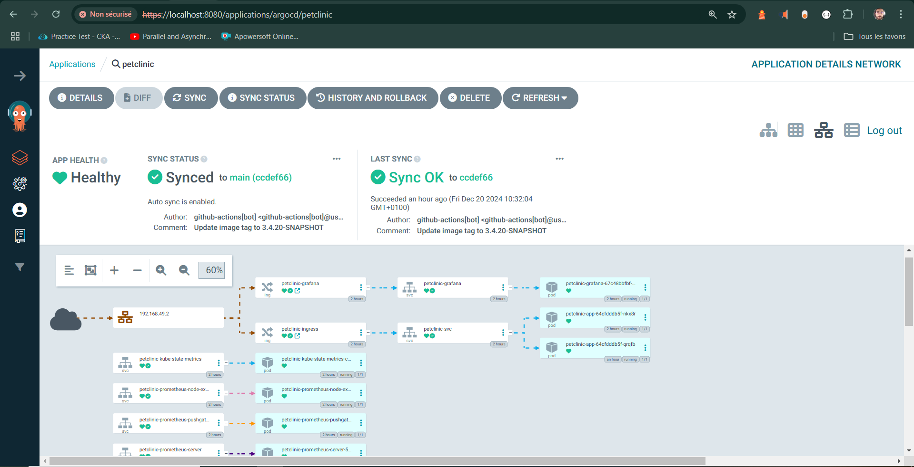
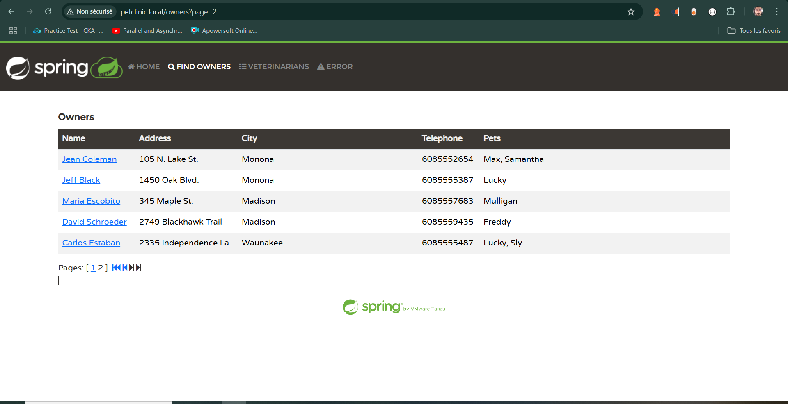

## Table of Contents
- [Overview](#spring-petclinic-sample-application-with-devops)
- [Prerequisites](#prerequisites)
- [Steps](#steps)
- [How to Use the App](#how-to-use-the-app)
- [Helm Project Structure](#helm-project-structure)
- [Horizontal Pod Autoscaler Test](#horizontal-pod-autoscaler-test)

# Spring PetClinic Sample Application with DevOps

This demo uses the Spring [Petclinic](https://github.com/spring-projects/spring-petclinic) sample app and integrates with it:

- Java 17 or newer (full JDK, not a JRE)
- CI/CD pipeline using Github Actions
- Helm project packaging all the manifest files required to run the app in a K8s cluster
- ArgoCD as a GitOps tool to Sync the deployed app with the Git repo
- Prometheus + Grafana for monitoring


## Prerequisites

To run this project locally you will need the following tools installed:

- Minikube
- Docker (will be used as a driver by Minikube can be switched with Virtual Box or other tools)
- Kubectl
- ArgoCD CLI


## Steps

1. Run Minikube
```bash
minikube start --driver=docker --cpus=4 --memory=4096 --cni=calico
```
2. Setup Minikube: Minikube may not have all the required addons activated from the start, this is why you need to activate them manually
   3. Ingress
   ```bash
   minikube addons enable ingress
   kubectl apply -f https://raw.githubusercontent.com/kubernetes/ingress-nginx/main/deploy/static/provider/cloud/deploy.yaml
   ```
   4. Networking
   ```bash
   kubectl apply -f https://docs.projectcalico.org/manifests/calico.yaml
   ```
   5. Metric server
   ```bash
   minikube addons enable metrics-server
   kubectl apply -f https://github.com/kubernetes-sigs/metrics-server/releases/latest/download/components.yaml
   ```
   Add the --kubelet-insecure-tls argument under spec.template.spec.containers.args
   ```bash
   kubectl edit deployment metrics-server -n kube-system
   kubectl delete pod -n kube-system -l k8s-app=metrics-server
   ```
   6. ArgCD
   ```bash
   kubectl create namespace argocd
   kubectl apply -n argocd -f https://raw.githubusercontent.com/argoproj/argo-cd/stable/manifests/install.yaml
   kubectl get pod -n argocd
   ```
   wait until all pods are up and running
   ```bash
   kubectl port-forward svc/argocd-server -n argocd 8080:443 &
   ARGOCD_PASSWORD=$(kubectl get secret argocd-initial-admin-secret -n argocd -o jsonpath="{.data.password}" | base64 -d)
   argocd login localhost:8080 --username admin --password $ARGOCD_PASSWORD --insecure
   ```
3. Clone the repo
4. Create a new argoCD app
   ```bash
   kubectl apply -f argocd-petclinic-app.yaml
   argocd app list
   ```
   At this step, ArgoCD will sync with the Git repo and deploy the application to you environment
   ```bash
   kubectl apply -f argocd-petclinic-app.yaml
   argocd app list
   ```
5. Minikube with Docker need tunneling to access the app
   ```bash
   minikube tunnel
   ```
6. update your hosts file 
   ```bash
   127.0.0.1 petclinic.local
   127.0.0.1 grafana.local
   ```
Now you can use the Petclinic app at petclinic.local
   
   
## How to use the app
Note: don't forget to update the version in the pom.xml file before pushing a new version
- Make any changes to the project code and create a Pull Request to the Main branch
- Github Actions workflow will be triggered (build and test the app)
- Merge to the Main branch. This will trigger the same workflow but this time with added s
 steps (build and test app -> build and push Docker image -> update Helm with the new tag)
- ArgoCD will detect the changes made to the Helm project and Sync the deployed version
- Check argoCD dashboard for live status updates and monitoring https://localhost:8080/
- Helm project automatically setup Prometheus and Grafana for monitoring. It automatically 
 configure a Prometheus data source in Grafana so that all you need to do is create a Dashboard of your liking 

## Helm project structure
Database
- templates/db-deployment.yaml: the deployment file for the postgresql database
- templates/db-pv-pvc.yaml: configures Persistent Volume and Persistent Volume Claim for the postgresql database
- templates/db-secret.yaml: configures secret to contain the postgresql database credentials
- templates/db-service.yaml: configures a ClusterIP type service for the postgresql database
App
- templates/db-deployment.yaml: the deployment file for the Petclinic app
- templates/hpa.yaml: configures a Horizontal Pod Autoscaler for the Petclinic app (Min pods :1, Max pods:2)
- templates/ingress.yaml: configures ingress that acts as a load balancer for the Petclinic app
- templates/namespace.yaml: configures a petclinic namespace
- templates/network-policy.yaml: configures a Network Policy that allows the database to accesp traffic only from the Petclinc app
- templates/service.yaml: configures a ClusterIP type service for the Petclinc app

## Horizontal Pod Autoscaler test
You can test that the number of pods can be automatically adjusted based on the CPU and Memory load by load tesing the app

Note: you can switch to branch postgresql-community-chart where you can find the same project but using the Bitnami Postgresql community chart



